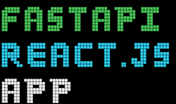
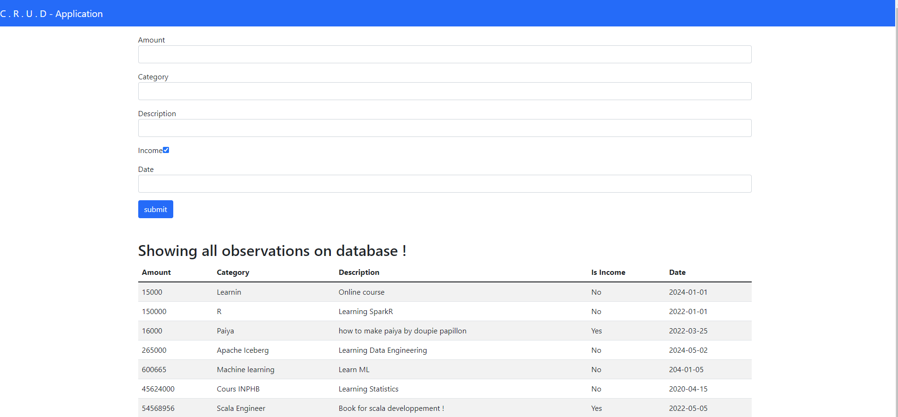

# Projet FASTAPI - REACTJS - SERVICES 

-------------------------------------------------------------------------------------------------------------------------------------------
## ENGLISH VERSION
This project aims primarily to explore microservices architecture concepts within a personal learning context. The main objectives are:

- **API Design with FastAPI**: The API will be developed using FastAPI, a modern web framework for Python, which allows for the rapid creation of high-performance APIs with automatic documentation.

- **Front-end Development with ReactJS**: The front-end will be constructed using ReactJS, a popular JavaScript library for building interactive user interfaces.

- **CORS (Cross-Origin Resource Sharing) Communication**: To enable secure communication between the front-end and the API when they are deployed on different origins, CORS will be configured on the server. This involves adding appropriate headers in the API responses to allow requests from specific domains, define allowed HTTP methods, and handle preferences for cookies and headers. This setup helps prevent Cross-Site Request Forgery (CSRF) attacks and ensures smooth integration between services.

- **Dockerization of Multiple Services with docker-compose**: The developed services will be containerized using Docker and managed with docker-compose, thus facilitating the deployment and management of different parts of the application.

## Technologies Used

- [FastAPI](https://fastapi.tiangolo.com/) for API creation
- [ReactJS](https://reactjs.org/) for front-end development
- Docker and Docker Compose for service containerization

## Installation and Execution

1. Clone this repository to your local machine.
> using command: git clone
 

2. Ensure Docker is installed.
> docker version 
> docker compose version
 

3. Use docker-compose to build and start the services:
> docker compose up -d 
 

4. Access to API adress : `http://localhost:8000` et the front-end at : `http://localhost:3000`.

## Application visualization
On `http://localhost:3000`  

## Licence

This project is on MIT licence [MIT](LICENSE).

-------------------------------------------------------------------------------------------------------------------------------------------
## FRENCH VERSION
Ce projet vise principalement à explorer les concepts de l'architecture microservices dans un contexte d'initiation personnelle. Les principaux objectifs sont :

- **Conception d'une API avec FastAPI** : L'API sera développée en utilisant FastAPI, un framework web moderne pour Python, qui permet de créer rapidement des API performantes avec une documentation automatique.

- **Développement d'un front-end avec ReactJS** : Le front-end sera construit en utilisant ReactJS, une bibliothèque JavaScript populaire pour la création d'interfaces utilisateur interactives.

- **Communication par CORS (Cross-Origin Resource Sharing)** : Pour permettre au front-end de communiquer de manière sécurisée avec l'API, même lorsqu'ils sont déployés sur des origines différentes, CORS sera configuré sur le serveur. Ceci implique l'ajout d'en-têtes appropriés dans les réponses de l'API pour autoriser les requêtes provenant de domaines spécifiques, définir les méthodes HTTP permises, et gérer les préférences en matière de cookies et d'en-têtes. Cette configuration aide à prévenir les attaques de type Cross-Site Request Forgery (CSRF) et assure une intégration fluide entre les services.

- **Dockerisation de plusieurs services avec docker-compose** : Les services développés seront conteneurisés à l'aide de Docker et gérés avec docker-compose, facilitant ainsi le déploiement et la gestion des différentes parties de l'application.

## Technologies utilisées

- [FastAPI](https://fastapi.tiangolo.com/) pour la création de l'API
- [ReactJS](https://reactjs.org/) pour le développement du front-end
- Docker et Docker Compose pour la conteneurisation des services

## Installation et exécution

1. Clonez ce dépôt sur votre machine locale. 
> using command: git clone

2. Assurez-vous d'avoir Docker installé.
> docker version 
> docker compose version
 

3. Utilisez docker-compose pour construire et démarrer les services :
> docker compose up -d 
 

4. Accédez à l'API à l'adresse : `http://localhost:8000` et au front-end à l'adresse : `http://localhost:3000`.

## Application visualization
En lançant l'url : `http://localhost:3000`  

## Licence

Ce projet est sous licence [MIT](LICENSE).

